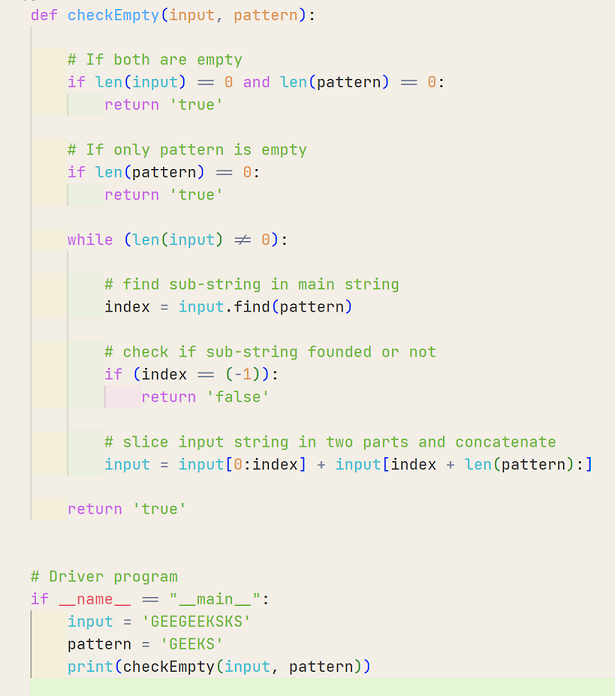
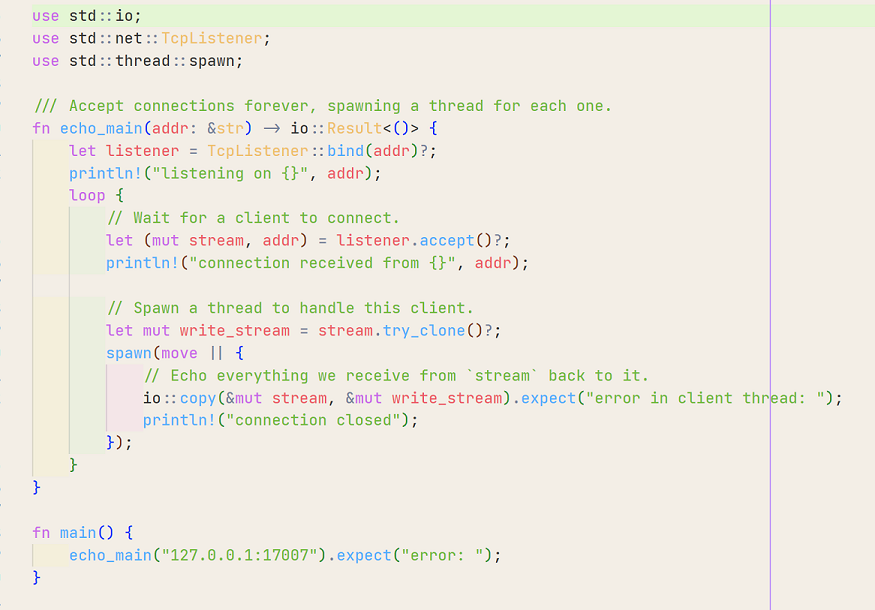

# Kurtsley-Light Theme

## A warmer light theme for VS Code

 

A combination of:
* [The Best Theme](https://github.com/jankohlbach/The-Best-Theme)
* The built in Quiet Light Theme
* An aged paper color thats easy on the eyes

 

---

 

### Python example

### Rust example

 

## Issues
Feel free to open an issue if you don't like a color combination or just customize it to suit your needs.
